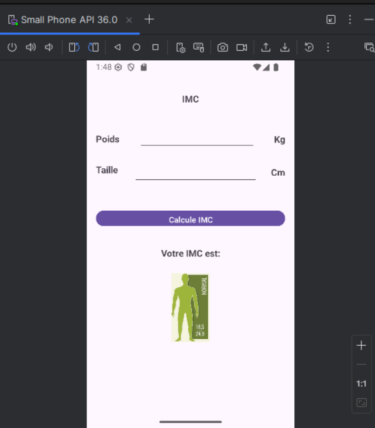
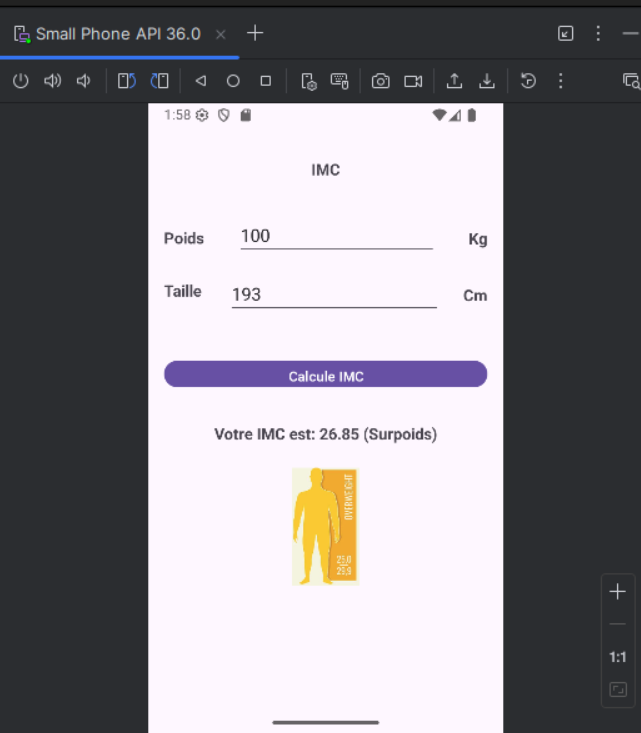
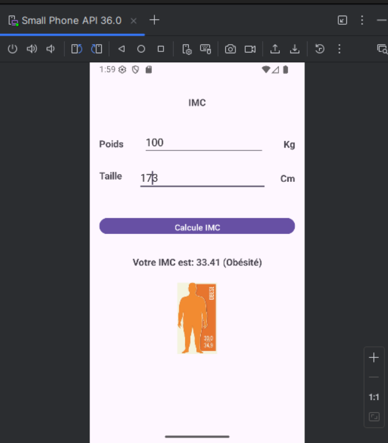
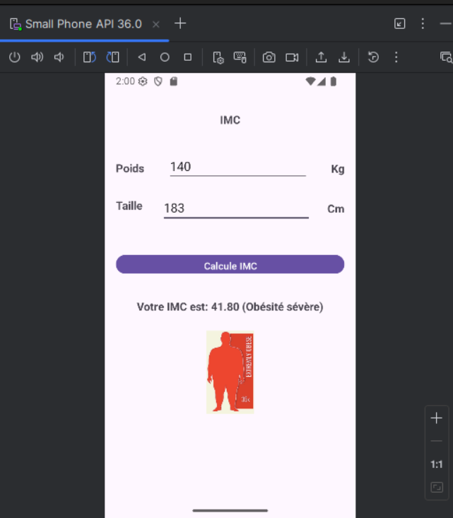
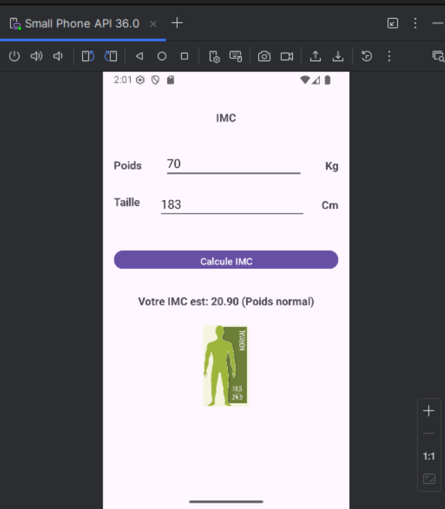
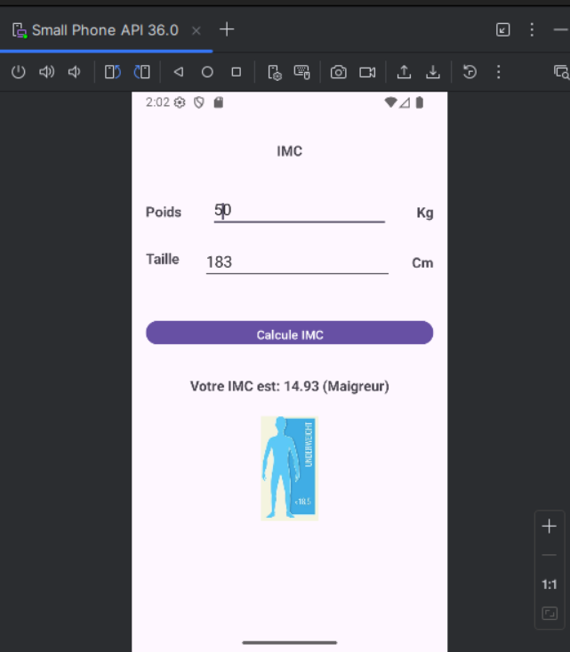

# App IMC - Calculateur d'Indice de Masse Corporelle

Application Android développée en Kotlin permettant de calculer l'IMC (Indice de Masse Corporelle) à partir du poids (kg) et de la taille (cm) de l'utilisateur, avec affichage d'une image correspondant à la catégorie d'IMC obtenue.

## Démarrage de l'application

## Notes de tests

### Surpoids
- Poids : 100 kg
- Taille : 193 cm

### Obésité
- Poids : 100 kg
- Taille : 173 cm

### Obésité sévère
- Poids : 140 kg
- Taille : 183 cm

### Normal
- Poids : 70 kg
- Taille : 183 cm

### Maigreur
- Poids : 50 kg
- Taille : 183 cm

## Catégories d'IMC (référence OMS)

| IMC | Catégorie |
|---|---|
| < 18.5 | Maigreur |
| 18.5 – 24.9 | Normal |
| 25 – 29.9 | Surpoids |
| 30 – 39.9 | Obésité |
| ≥ 40 | Obésité sévère |